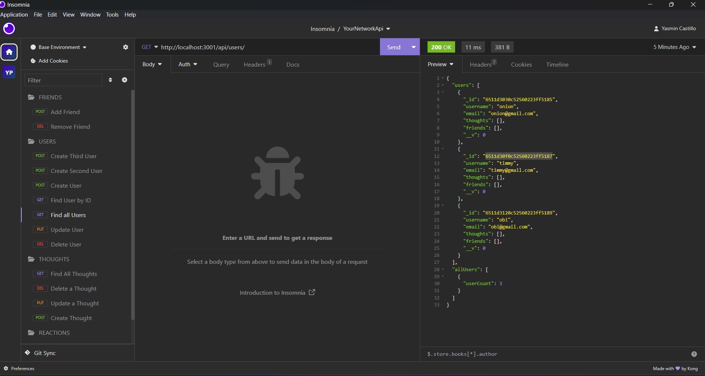

# YourNetworkAPI

This API was created for a social network application using express, MongoDB, and Mongoose. This was created to have users share their thoughts, react to their friend's thoughts and for users to be able to create a friend's list through CRUD operation. This project allowed me understand and use MongoDB and Mongoose at a closer level.

## Table of Contents
- [Installation](#installation)
- [Usage](#usage)
- [Credits](#credits)
- [License](#license)

## Installation
To install this application, please follow the instructions below:
- Make sure to have INSOMNIA installed beforehand.
- Clone this [repository](https://github.com/XDSirius/YourNetworkAPI)
- Once cloned, open the file
- Open a new terminal and make sure you are in the correct folder
- Run `npm install`
- After installing the necessary dependencies: run `npm start`
- Once the server has started, you are now able to use this application.

## Usage
For an in-depth guide, please watch the video walkthrough: 
https://watch.screencastify.com/v/EJZ10GNSTAl5l8PPTOo0

 
### Users

You will be able to create, delete, update, and see all users with this endpoint `http://localhost:3001/api/users/` using the following:   
 - `POST`  To add a user you need the JSON body to contain this information:
  `{"username": "obi","email": "obi@gmail.com"}`
 - `GET` By having the endpoint, no other information is required and you may submit it as is with the `GET` request and you will get all users back
 - `DELETE` To delete the user, you will need to input the userid of the user you want to delete like so: `http://localhost:3001/api/users/:userId` 
 - `PUT` To update a user, you will need to have the id of the user you want to update like so: `http://localhost:3001/api/users/:userId` and in the JSON body you need to have the following with the updated information `{"username": "obi","email": "obi@gmail.com"}` 

### Thoughts
[Thoughts](./imgs/thoughts.png)
### Friends
[Friends](./imgs/friends.png)
### Reactions
[Reactions](./imgs/reactions.png)

## Credits

Credit to the University of Minnesota for providing resources, tutors, and instructors and staff for making this possible. 

## License

MIT License

